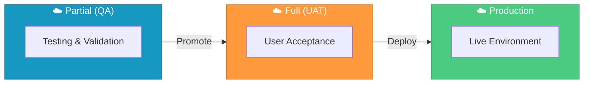

# 

Salesforce DX project containing the core Salesforce customizations for similarweb.

## Environments



| Environment | Purpose | Org Type |
|-------------|---------|----------|
| **Partial (QA)** | Development testing and validation | Partial Sandbox |
| **Full (UAT)** | User acceptance testing before production | Full Sandbox |
| **Production** | Live environment | Production Org |

## Project Structure

```
force-app/
└── main/
    └── default/
        ├── applications/     # Custom applications
        ├── classes/          # Apex classes
        ├── triggers/         # Apex triggers
        ├── pages/            # Visualforce pages
        ├── objects/          # Custom objects and fields
        ├── permissionsets/   # Permission sets
        ├── staticresources/  # Static resources
        └── tabs/             # Custom tabs
```

## Prerequisites

- [Salesforce CLI](https://developer.salesforce.com/tools/sfdxcli)
- [Node.js](https://nodejs.org/) (LTS version recommended)
- Access to similarweb Salesforce org

## Development Environment Setup

### 1. Install Dependencies

After cloning the repository, install the npm packages:

```bash
npm install
```

This installs:
- **Prettier** with Apex and XML plugins for code formatting
- **ESLint** for JavaScript linting
- **Husky** for Git hooks (auto-formats code on commit)
- **Jest** for LWC unit testing

### 2. Install Required Extensions

Install these extensions in VS Code or Cursor:

| Extension | ID | Purpose |
|-----------|-----|---------|
| Salesforce Extension Pack | `salesforce.salesforcedx-vscode` | Apex, LWC, SOQL support |
| Prettier - Code formatter | `esbenp.prettier-vscode` | Auto-formatting on save |

You can install them via command line:

```bash
code --install-extension salesforce.salesforcedx-vscode
code --install-extension esbenp.prettier-vscode
```

Or for Cursor:

```bash
cursor --install-extension salesforce.salesforcedx-vscode
cursor --install-extension esbenp.prettier-vscode
```

### 3. Verify Setup

The workspace settings (`.vscode/settings.json`) are pre-configured to:
- Format files automatically on save
- Use Prettier as the default formatter for Apex, JavaScript, HTML, CSS, JSON, and XML

To verify Prettier is working:

```bash
npm run prettier:verify
```

## Getting Started

1. **Clone the repository**
   ```bash
   git clone https://github.com/similarweb/salesforce.git
   cd salesforce
   ```

2. **Authenticate with your Salesforce org**
   ```bash
   sf org login web --alias my-org
   ```

3. **Deploy to your org**
   ```bash
   sf project deploy start --target-org my-org
   ```

## Development Workflow

### Retrieve metadata from org
```bash
sf project retrieve start --target-org my-org
```

### Deploy changes to org
```bash
sf project deploy start --target-org my-org
```

### Deploy specific metadata
```bash
sf project deploy start --source-dir force-app/main/default/classes --target-org my-org
```

## NPM Scripts

| Command | Description |
|---------|-------------|
| `npm run prettier` | Format all code files |
| `npm run prettier:verify` | Check formatting without modifying files |
| `npm run lint` | Run ESLint on Aura and LWC JavaScript |
| `npm run test:unit` | Run LWC Jest unit tests |
| `npm run test:unit:watch` | Run tests in watch mode |
| `npm run test:unit:coverage` | Run tests with coverage report |

## Configuration

- `sfdx-project.json` - Project configuration
- `manifest/package.xml` - Package manifest for deployments
- `.prettierrc` - Prettier formatting configuration
- `.vscode/settings.json` - Editor settings for format-on-save

## Resources

- [Salesforce CLI Command Reference](https://developer.salesforce.com/docs/atlas.en-us.sfdx_cli_reference.meta/sfdx_cli_reference/cli_reference.htm)
- [Salesforce DX Developer Guide](https://developer.salesforce.com/docs/atlas.en-us.sfdx_dev.meta/sfdx_dev/sfdx_dev_intro.htm)
